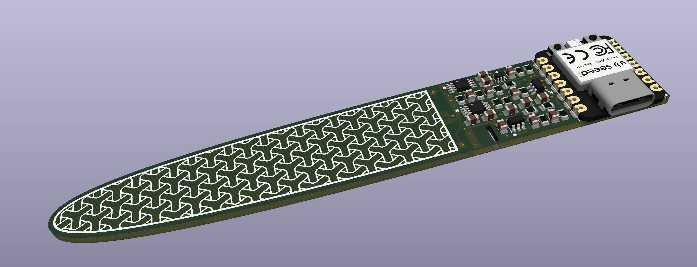

# PCB Strain Gauge

A strain gauge, with amplifier, where the sensing element is the circuit board itself. Sensitive enough to measure deflections in the range of micrometers while having a full scale deflection range of +/- 3cm.

https://github.com/vapetrov/PCB_strain_gauge/assets/7529600/8c5e6594-8a19-4efe-8d25-b016dfba4ef4

## Manufacturing
The recommended board thickness is 0.6mm, although it could be made thicker or thinner for different applications. Thinner boards will result in a smaller output voltage swing.

- strain_gauge_3.zip
    - 20 mm x 118 mm, 2 layer
    - 0.15mm (~6mil) min trace width
    - 4-element sensing bridge
- strain_gauge_3_rotated.zip
    - Same as the previous one, except it uses 2-element sensing.
    - Lower thermal drift and bias from manufacturing (theoretically)
- stran_gauge_stiffener.zip
    - 20 mm x 42 mm rectangle to keep the component side from flexing
    - Can be affixed to the board with 3M VHB 5906

## Assembly
This project was made with hand-assembly in mind, and does not require hot air or a reflow oven.

The board can be used standalone with an integrated microcontroller (Seeed Studio XIAO RP2040) or an external microcontroller through the header pins.  
The external ADC (U5) can be omitted, and the analog voltage can be sampled directly on the "OUT" pin.  
The bias voltage generator (U8, U4) can also be omitted by placing a jumper wire between pins 2&3 on U8. Doing this will result in a measureable voltage on the output when no force is applied. 

## Programming

The included sample firmware will wait until a serial console is opened, perform a 5 second offset calibration, then sample continuously at the lowest gain setting. The `graph.py` script can be used to display the output.  
For high sensitivity measurements, it's important to let the board reach a stable operating temperature for at least 5 minutes before calibrating.

## Customatization

To customize the shape of the sensing element, `draw_footprint.ipynb` can be used to generate an outline of a given width, height and curvature. The resulting `.svg` can be imported into Inkscape and converted into a KiCad footprint using the [svg2shenzen](https://github.com/badgeek/svg2shenzhen) tool.
